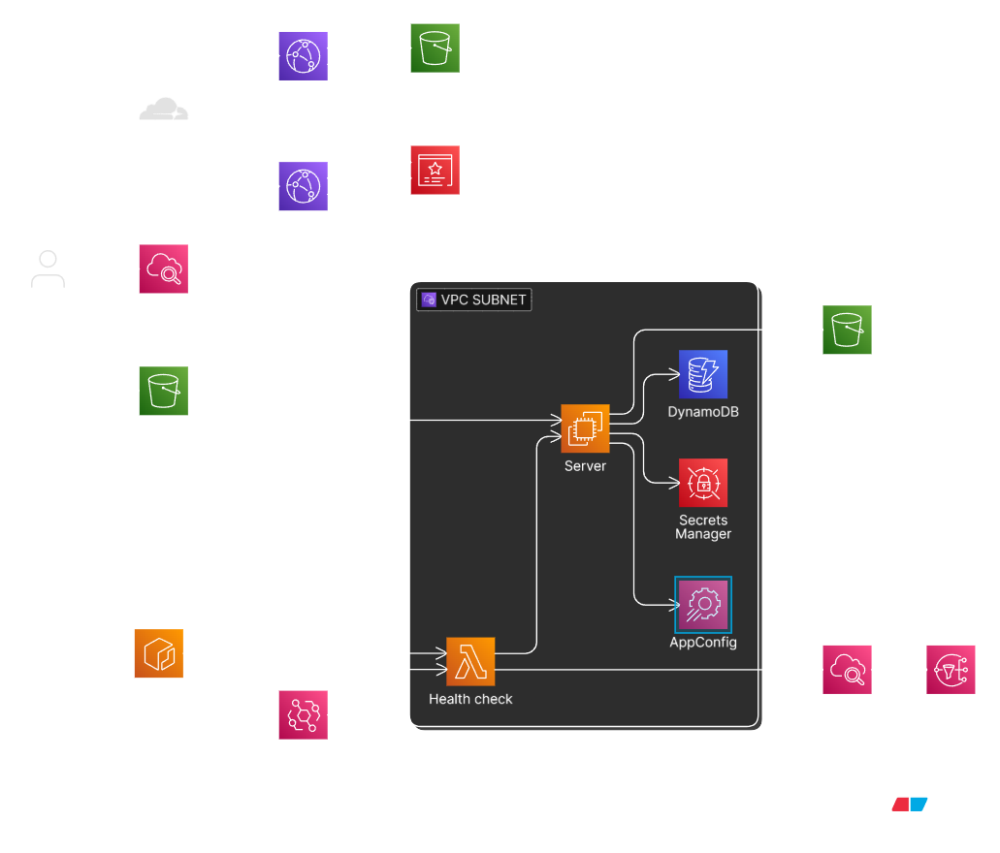

# Xander1233 Portfolio API

This is the API for Xander1233's portfolio website.

It provides endpoints to retrieve information about projects, skills, and contact details.

The infrastructure is provisioned and managed using Terraform. All resources are hosted on AWS and Cloudflare R2.

## Infrastructure

